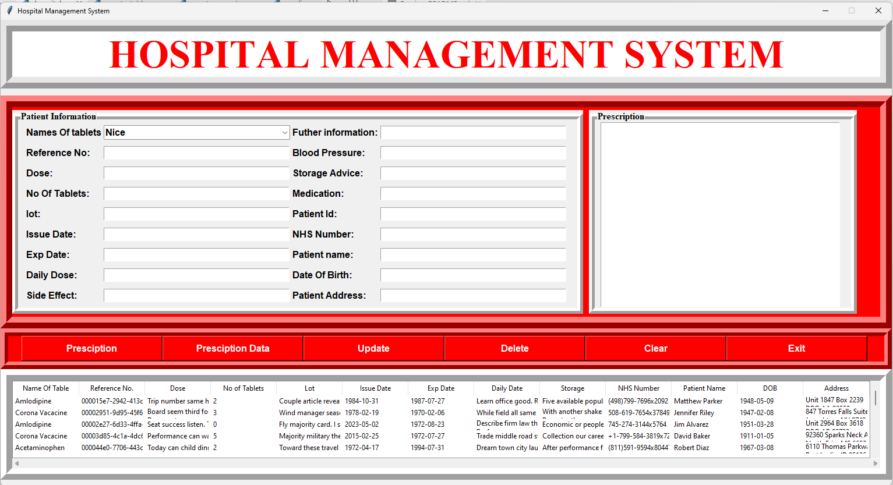

# Hospital Management System

# How to run

### Step 1: create database and `config.py` which has template file.

### Step 2: run `create_table.py`

### Step 3: run `create_records.py`

#### You can skip step 2&3 using [link](https://drive.google.com/file/d/1ZbF5OTUG4Of0oyhzxE1AT2puwiKTHANJ/view?usp=drive_link)

### Final : run `hospital.py`

# How to use

### I - click `Presciption` to show the in4 to the right screen.

### II - click `Presciption Data` to insert to DB.

### III - click `Update` to update a row you choose below.

### IV - click `Delete` to delete chosen row.

### V - click `Clear` to clear the table.

### VI - click `Exit` to quit the app.
